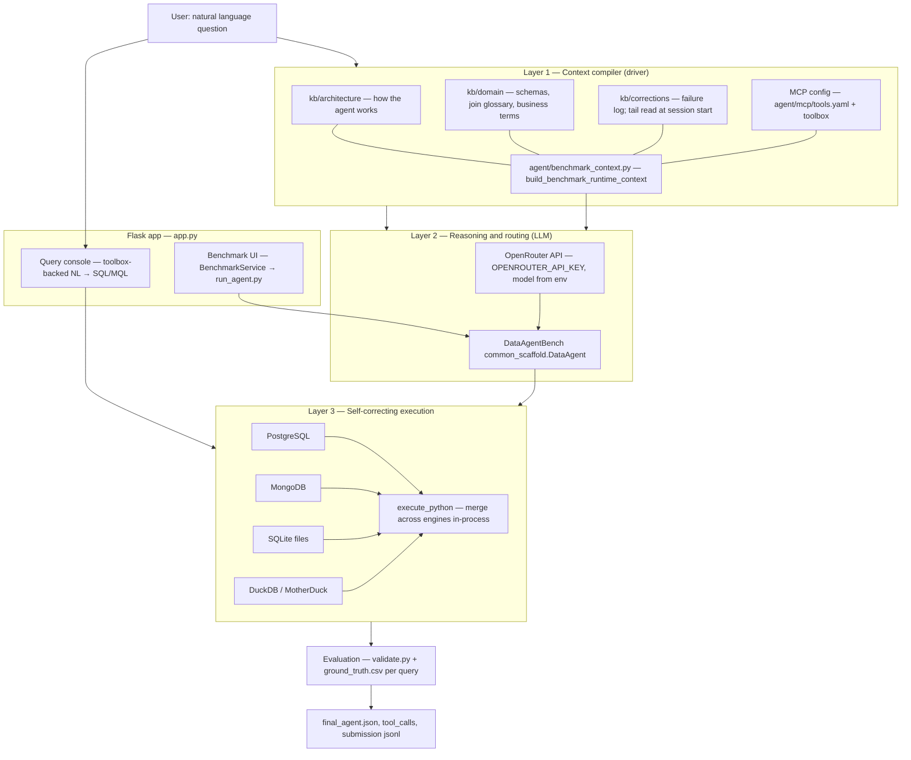

# Oracle Forge Data Agent

**Programme:** TRP1 FDE — Tenacious Intelligence Corp  
**Team:** Team Mistral  
**Benchmark:** [DataAgentBench (DAB)](https://github.com/ucbepic/DataAgentBench) — natural-language analytics across PostgreSQL, SQLite, MongoDB, and DuckDB with auditable tool traces.

This repository is the **Oracle Forge** stack: a Flask web console, an MCP-style toolbox integration, a layered knowledge base under `kb/`, and a **benchmark service** that shells into `DataAgentBench/run_agent.py` with Oracle Forge runtime context (`agent/benchmark_context.py`).

---

## Team members and roles

Roster is maintained from the Sprint 01 inception record (`planning/sprint_01_inception.md`).

| Name | Role |
|------|------|
| Nebiyou Belayineh | Driver (implementation, integration) |
| Hiwot Beyene | Driver (implementation, integration) |
| Martha Ketsla | Intelligence Officer (KB, architecture alignment) |
| Nahom Desalegn | Intelligence Officer (KB, evaluation) |
| Tsegaye Assefa | Signal Corps (ops, signal / engagement) |
| Abdulaziz | Signal Corps (ops, signal / engagement) |

**Facilitator** (workshop or shared server): ensure repos, Docker services, API keys, and paths in this README match your machine; coordinate with Drivers for path or port overrides.

---


## Architecture diagram

The diagram below is **equivalent in content** to the ASCII pipeline in `kb/architecture/architecture_system_overview.md`. Teams may **replace this section** with a hand-drawn flow photographed from a whiteboard if that is easier for stakeholders.



**How this maps to the KB (not vague):**

| KB area | Path | What it defines |
|--------|------|------------------|
| System overview | `kb/architecture/architecture_system_overview.md` | Four layers in prose: Context Compiler → LLM → Execution loop (join resolver, retries, KB v3 writes) → Evaluation harness; four KB subtrees (`architecture`, `domain`, `evaluation`, `corrections`). |
| Memory index | `kb/architecture/MEMORY.md` | Pointer layer listing topic files (overview, memory layers, tool scoping, OpenAI six layers, table enrichment, Oracle mapping, changelog). |
| OpenAI six layers | `kb/architecture/openai_six_layers.md` | Cumulative context: raw schema → expert descriptions → Codex/pipeline enrichment → institutional knowledge → **learning memory** (`kb/corrections/log.md`, last entries at session start) → runtime `query_db` / `execute_python`. DAB-specific failures: join key mismatch (types/padding), ambiguous business definitions. |
| Tool scoping | `kb/architecture/claude_tool_scoping.md` | **Separate tools per engine** (Postgres vs Mongo vs SQLite vs DuckDB) for reliability and traceability; **zero-row rule** (investigate keys, filters, table choice before reporting empty); **cross-DB merge**: query each side separately, merge in Python, **no cross-engine SQL joins**. |
| Oracle Forge mapping | `kb/architecture/oracle_forge_mapping.md` | Concrete code touchpoints: `utils/oracle_forge_utils.py` (unified schema), domain markdowns, `kb/corrections/kb_v3_corrections.md`, `agent/tools.yaml` / runtime tools. |
| Architecture index | `kb/architecture/README.md` | Full file index and **injection test** protocol (`kb/architecture/injection_tests/`) — documents must pass structured tests before being trusted as agent ground truth. |

**Runtime wiring (this repo + DAB):**

- **`apply_env_files()`** in `app.py` loads **`DataAgentBench/.env` first**, then **`oracle-forge-data-agent/.env`**, so keys like `OPENROUTER_API_KEY` can live in the forge repo while Postgres/Mongo URLs stay with DAB.
- **`BenchmarkService`** (`benchmark_service.py`) discovers queries under `DAB_ROOT`, allocates `run_<n>` under `query_*/query*/logs/data_agent/`, runs `python3 run_agent.py ...`, scores with DAB `validate.py`, and appends rows to `results/benchmark_submission_rows.jsonl` when valid (strict by default: `BENCHMARK_REQUIRE_VALID=1`).
- **`run_agent.py`** sets `ORACLE_FORGE_ROOT` (default `/week8-9/oracle-forge-data-agent`) and loads `build_benchmark_runtime_context` so each trial gets **join glossary slice + KB layers + `PATTERN_AND_JOIN_PLAYBOOK` + `TOOL_CONTRACT`** appended to the agent description.

---

## Facilitator setup (fresh machine)

### 0. Layout this codebase expects

`app.py` currently uses **fixed paths** for DataAgentBench:

- `DAB_ROOT = /week8-9/DataAgentBench`
- `DAB_ENV_FILE = /week8-9/DataAgentBench/.env`
- `DAB_DUCKDB_FILE = /week8-9/DataAgentBench/query_yelp/query_dataset/yelp_user.db`

**Recommended:** create `/week8-9` and clone both repos side by side:

```text
/week8-9/
├── DataAgentBench/          # upstream benchmark + docker + run_agent.py
└── oracle-forge-data-agent/ # this repo
```

If you cannot use `/week8-9`, you must **edit those constants in `app.py`** (and set `ORACLE_FORGE_ROOT` for `run_agent.py`) to match your layout.

### 1. System prerequisites

- Python **3.10+** (3.12 matches the DAB Docker image tag in compose).
- **Docker** and Docker Compose v2 (for Postgres and Mongo in DAB).
- Network access for **OpenRouter** (LLM) and optional **MotherDuck** if DuckDB cloud is used.

### 2. DataAgentBench: services and `.env`

```bash
cd /week8-9/DataAgentBench
docker compose up -d
```

Align **`DataAgentBench/.env`** with `docker-compose.yaml`:

- Postgres: host port **5433** → container5432; user **`postgres`**; password from compose (**`trp-mistral`** in the reference file); database **`dab`**.
- Mongo: **`localhost:27018`** with root user **`mistral`** / password **`trp-mistral`** (`authSource=admin`).

Load any dataset-specific instructions from DAB (SQL init, SQLite paths). Paths like `SQLITE_BOOKREVIEW_PATH` in `.env` must point at real files under `DataAgentBench/query_*/`.

### 3. Oracle Forge: Python deps and secrets

```bash
cd /week8-9/oracle-forge-data-agent
python3 -m pip install -r requirements.txt
```

Copy and fill secrets (do not commit real keys):

```bash
cp .env.example .env   # if present; otherwise create .env
```

Minimum for the benchmark UI and agent:

- **`OPENROUTER_API_KEY`** — required for LLM calls.
- Optional: **`OPENROUTER_ROUTER_MODEL`**, **`BENCHMARK_LLM`**, **`MOTHERDUCK_TOKEN`**, **`DUCKDB_MOTHERDUCK_URI`** per your stack.

### 4. Run the web application

```bash
cd /week8-9/oracle-forge-data-agent
python3 app.py
```

Defaults: **`http://127.0.0.1:8080`** (or `http://0.0.0.0:8080` from other machines if firewall allows). Overrides:

- **`PORT`** — listen port (default `8080`).
- **`FLASK_HOST`** — bind address (default `0.0.0.0`).
- **`FLASK_DEBUG`** — `1` / `true` / `yes` for debug and reloader.

### 5. Smoke-check the benchmark path

From the UI, select a dataset and query, then **Run One Trial** (one `run_<n>` unless `BENCHMARK_RUN_ONE_K` is greater than 1). On failure, check:

- Terminal logs from **`benchmark_service`** (full `run_agent` stdout/stderr on failure).
- `results/benchmark_debug.log` and `results/benchmark_ops_log.jsonl`.

### 6. Optional: eval harness

See **`eval/README.md`** for manifest-driven scoring, `DAB_ROOT` overrides for the eval package, and held-out configuration.

**Sprint 1 evaluation snapshot:** Evaluation runs as a re-scorer over stored DAB traces (Sentinel-style trace summary + regression suite) and uses only DataAgentBench `common_scaffold/validate/validate.py` as the validator. At the focused Sprint 1 checkpoint (`bookreview`, `yelp`, `query1`, `n=1` per dataset), `first_run` scored pass@1 `0.5000` (1/2) and `submission` scored pass@1 `1.0000` (2/2), improving by `+0.5` after Layer-2 KB guidance on Yelp’s MongoDB-metadata / DuckDB-ratings split; regression gate `submission >= first_run` passed. Full held-out scope remains 12 datasets, and `n>=50` trials is planned for Sprint 2 DAB PR runs.

---

## Repository map (quick reference)

| Path | Role |
|------|------|
| `app.py` | Flask app: query console, benchmark routes, OpenRouter client, DuckDB/Mongo helpers. |
| `benchmark_service.py` | Catalog discovery, `run_agent` orchestration, validation, jsonl exports. |
| `agent/benchmark_context.py` | KB packaging for DAB trials. |
| `agent/mcp/` | Toolbox and `tools.yaml` for MCP-style tools. |
| `kb/` | Architecture, domain, evaluation, corrections — agent ground truth. |
| `eval/` | Scoring harness, manifests, score logs. |
| `results/` | Benchmark logs and submission artifacts (gitignored if configured). |

---

## Further reading

- `kb/architecture/architecture_system_overview.md` — full layered narrative and token-budget table for mandatory preloads.
- `planning/sprint_01_inception.md` — team roster, FAQs, and definition of done.
- `eval/README.md` — DataAgentBench execution and strict vs debug submission behavior.
